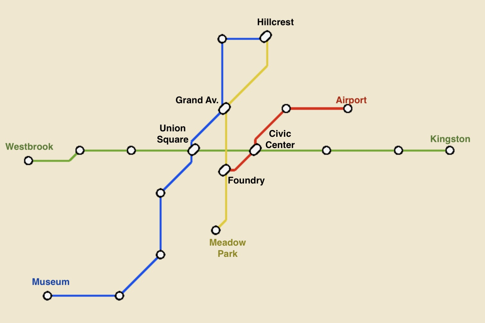

# Metro Network Search

## Introduction

Build the graph behind a terminal-based metro system. The TUI lets a rider view the network, plan routes, simulate a ride, manage service closures, and use an extra-credit Trip Assistant.

Your implementation belongs in metro/network.py. Do not change the public method signatures there.

The metro system you will use for this assignment is the following.



The network consists of four lines and 19 stations:

| ID  | Station       | Lines          |
|-----|---------------|----------------|
| WBK | Westbrook     | Green          |
| MKS | Market Square | Green          |
| OKS | Oak Street    | Green          |
| UNS | Union Square  | Green, Blue    |
| CVC | Civic Center  | Green, Red     |
| RVP | Riverside Park| Green          |
| MPW | Maplewood     | Green          |
| KGS | Kingston      | Green          |
| HLC | Hillcrest     | Blue, Yellow   |
| PNS | Pine Street   | Blue           |
| GAV | Grand Avenue  | Blue, Yellow   |
| UNV | University    | Blue           |
| LKS | Lakeside      | Blue           |
| HBP | Harbor Point  | Blue           |
| MSM | Museum        | Blue           |
| FND | Foundry       | Yellow, Red    |
| MDP | Meadow Park   | Yellow         |
| MKT | Market Street | Red            |
| AIR | Airport       | Red            |


## Setup

From this project directory:

```bash
python -m venv .venv
source .venv/bin/activate
python -m pip install -r requirements.txt
```

On Windows PowerShell, activate the environment with:

```powershell
.venv\Scripts\Activate.ps1
```

## Run and validate

Configure stations and lines in `metro/topology.py`, then start the TUI:

```bash
python -m metro.main
```

Run the grading tests with:

```bash
pytest
```

The tests in `metro/test_network.py` create their own stations, registries, and
lines. They do not depend on the topology configured for the TUI.

## Student instructions

### Part 1: Core graph operations

Implement these methods in `MetroNetwork`:

- `add_line`
- `get_connected_stations`
- `find_route`
- `as_adjacency_list`
- `as_adjacency_matrix`

This part focuses on representing a graph and using it to solve a problem.
Lines connect consecutive stations, route finding supports BFS and DFS, and
the two adjacency methods expose the current graph structure.

### Part 2: Network administration and mutable graph state

Implement:

- `close_segment`
- `open_segment`
- `get_closed_segments`

A closed segment blocks travel only in its configured direction. Your graph
queries and route searches must always reflect the current closure state.
This part focuses on mutating an existing graph safely and consistently.

### Part 3: Extra credit - Trip Assistant

Implement:

- `find_route_with_lines`

This method powers the Trip Assistant, which converts a route into
line-aware instructions such as where to board, ride, and transfer. Focus on
the business logic that turns graph results into useful metro guidance.