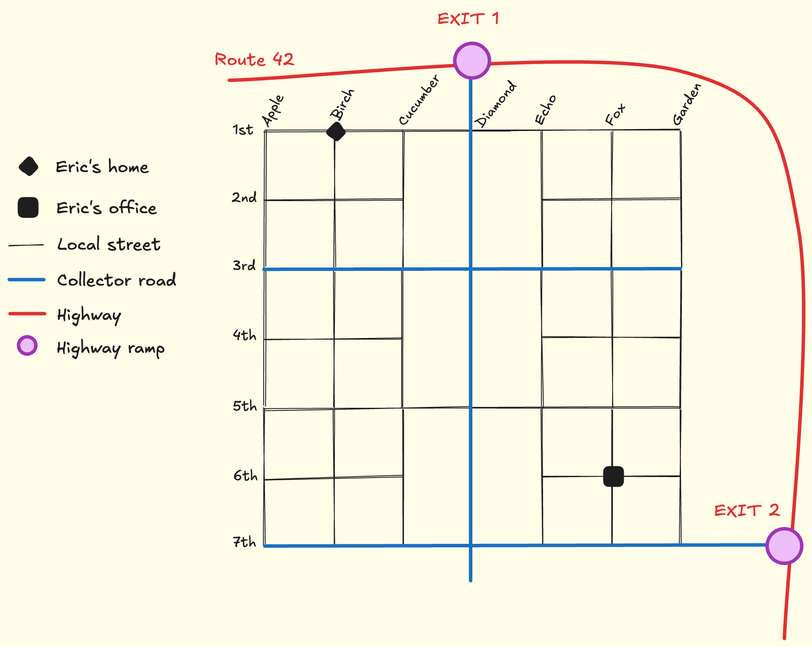

# Commute route planner

## Introduction

In urban planning, there are three types of roads: arterial roads, collector roads, and local roads. Arterial roads are major highways that connect different parts of a city or region. Collector roads are secondary roads that connect local roads to arterial roads. Local roads are smaller streets that provide access to residential areas and businesses.

In a well designed city:
- Local roads have low speed limits and a lot of intersections, since their job is to provide access to all houses and businesses in a neighborhood.
- Collector roads have higher speed limits, but fewer intersections, since their job is to collect traffic from local roads and funnel it to arterial roads.
- Arterial roads have the highest speed limits and the fewest intersections, since their job is to move large volumes of traffic efficiently across long distances. 

In this activity, you will help Eric find a route to commute from his home to his workplace. You will be given a map of the city, which includes the locations of Eric's home and workplace, as well as the different types of roads in the city. While Eric is not concerned about finding the optimal route, he does need to take into account the following:
- How much distance he will have to travel
- How much time will it take him to complete his commute

Eric lives in the city of Cherry Hills, at the intersection of Birch & 1st, and it's workplace is located at Fox & 6th. The map below shows the layout of the city, including the locations of Eric's home and workplace, as well as the different types of roads in the city.

The city council of Cherry Hills has the following rules regarding road types:
- Local roads are spaced 1 block apart and have a speed limit of 15 km/h.
- Each block is 500 meters long.
- Collector roads hace a speed limit of 40 km/h and are spaced 4 blocks apart.
- Arterial roads have a speed limit of 80 km/h, and exits must be spaced with at least 1km between them.

The following is a rough map of Cherry Hills.




## Setup

From this project directory:

```bash
python -m venv .venv
source .venv/bin/activate
python -m pip install -r requirements.txt
```

On Windows PowerShell, activate the environment with:

```powershell
.venv\Scripts\Activate.ps1
```

## Run and validate

Run the trip planner TUI with:

```bash
python -m commuter.main
```

Run the grading tests with:

```bash
pytest
```

The tests in `commuter/test_cost.py` and `commuter/test_planner.py` create
their own stub `MapService` and `TripCostCalculator` instances with small,
hand-crafted graphs. They do not depend on the map of Cherry Hills used by
the TUI.

## Student instructions

Your implementation belongs in `commuter/cost.py` and `commuter/planner.py`.
Do not change the public method signatures there.

You are provided with a `MapService` class that has the following methods:
- `create_city_map`: returns the map of Cherry Hills, represented as an adjacency list where each node is a junction and each edge is a road connecting two junctions.
- `create_speed_limits_map`: returns the same adjacency list, but each edge is paired with the speed limit of that road, expressed in km/h.
- `create_distances_map`: returns the same adjacency list, but each edge is paired with the distance of that road, expressed in meters.

Each of these methods returns a fresh copy of the underlying map, so callers are free to use the result without risking mutation of `MapService`'s internal state.

### Part 1: Trip cost calculators

Implement `get_cost` in:

- `TripDistanceCalculator`, which must return the total distance of a route in kilometers.
- `TripDurationCalculator`, which must return the total duration of a route in minutes, based on the distance and speed limit of each road in the route.

Both calculators raise a `ValueError` if the route contains a road that is not present in the underlying map.

The "Compare routes" option in the TUI can be used to validate the cost calculators against pre-defined routes. Note that to this is only added for your convenience, and is not part of the grading tests. The `pytest` test suite is the only source of truth for grading.

### Part 2: Trip planner

Implement `TripPlanner.plan_route`. This method must:
- Raise a `ValueError` if either the origin or the destination is not part of the city map.
- Raise a `ValueError` if there is no route connecting the origin and the destination.
- Otherwise, return a `Plan` comprised of a route to take (expressed as a list of the intersections/nodes of the city map) and the total cost of the trip.

You are not required to find the best route, only *a* route. The cost of the trip can be calculated using either distance or duration, depending on the instance of `TripCostCalculator` used to instantiate `TripPlanner`.

The TUI options "See how much distance he will travel" and "See how much time he will spend traveling" can be used to validate the trip planner implementation. Note that to this is only added for your convenience, and is not part of the grading tests. The `pytest` test suite is the only source of truth for grading.
